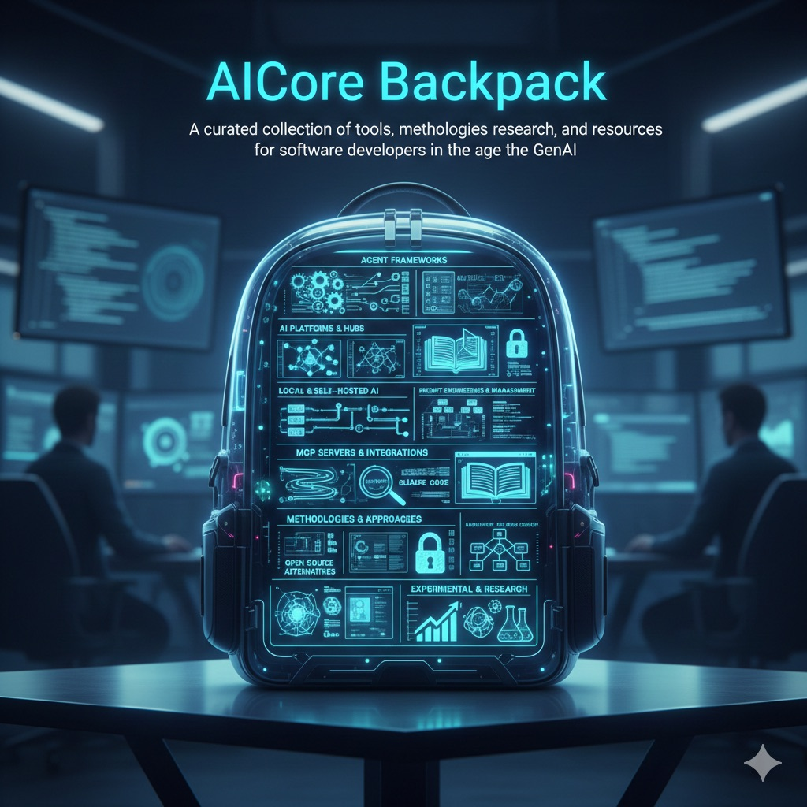

# AICore Backpack

  

A curated collection of tools, methodologies, research, and resources for software developers in the age of GenAI.

> **Note:** This is not a beginner's guide to AI tools. If you're already familiar with the basics (ChatGPT, Copilot, Cursor, etc.), this collection goes deeper: cool tools, extensions, open-source alternatives, videos, research papers, and interesting links to level up your AI-powered development workflow.

## Categories

### Agent Frameworks

Frameworks and libraries for building AI agents with planning, delegation, and autonomous capabilities.

<!-- TOOLS:agent-frameworks -->
- **[CrewAI](tools/crewai.md)** - Multi-agent platform with role-based agent design for collaborative AI workflows ([GitHub](https://github.com/crewAIInc/crewAI))
- **[Deep Agents](tools/deep-agents.md)** - Open-source agent framework with planning, sub-agents, and MCP integration ([GitHub](https://github.com/langchain-ai/deepagents))
- **[HumanLayer SDK](tools/humanlayer-sdk.md)** - API and SDK for human-in-the-loop approval workflows in AI agent systems ([GitHub](https://github.com/humanlayer/humanlayer))
- **[LangGraph](tools/langgraph.md)** - Framework for building stateful, multi-actor AI agents with cyclic workflows and human-in-the-loop support ([GitHub](https://github.com/langchain-ai/langgraph))
- **[Mem0](tools/mem0.md)** - Intelligent memory layer enabling AI agents to remember user preferences and learn continuously ([GitHub](https://github.com/mem0ai/mem0))
<!-- /TOOLS:agent-frameworks -->

### AI IDEs & Editors

AI-powered integrated development environments and code editors with autonomous coding capabilities.

<!-- TOOLS:ai-ides-editors -->
- **[Cline](tools/cline.md)** - Open-source autonomous AI coding agent — plug in any model, works across VS Code, JetBrains, Cursor, and Windsurf ([Website](https://cline.bot))
- **[Google Antigravity](tools/google-antigravity.md)** - Agentic IDE powered by Gemini 3 that autonomously executes multi-step coding tasks ([Website](https://www.index.dev/blog/google-antigravity-agentic-ide))
- **[Kiro](tools/kiro.md)** - Spec-driven agentic IDE that structures requirements and design before generating code, with CLI and agent hooks ([Website](https://kiro.dev))
<!-- /TOOLS:ai-ides-editors -->

### AI Platforms & Hubs

Central platforms for AI model discovery, sharing, and collaboration.

<!-- TOOLS:platforms -->
- **[Hugging Face](tools/hugging-face.md)** - AI community platform with 1M+ models and Transformers library for local model execution ([Website](https://huggingface.co/))
- **[Teamwork Graph](tools/teamwork-graph.md)** - Atlassian's unified data layer with GraphQL API for AI-driven insights across apps ([Website](https://developer.atlassian.com/platform/teamwork-graph/))
<!-- /TOOLS:platforms -->

### Local & Self-Hosted AI

Tools for running AI models locally, self-hosted solutions, and privacy-focused alternatives.

<!-- TOOLS:local-ai -->
- **[LM Studio](tools/lm-studio.md)** - Desktop app for running LLMs locally with OpenAI-compatible API and developer SDKs ([Website](https://lmstudio.ai/))
- **[Ollama](tools/ollama.md)** - Run large language models locally with a simple CLI and API ([Website](https://ollama.com))
- **[vLLM](tools/vllm.md)** - High-performance LLM inference and serving library with PagedAttention and OpenAI-compatible API ([GitHub](https://github.com/vllm-project/vllm))
<!-- /TOOLS:local-ai -->

### MCP Servers & Integrations

Model Context Protocol servers, integrations, and extensions for Claude and other AI assistants.

<!-- TOOLS:mcp -->
- **[Context7](tools/context7.md)** - MCP server delivering up-to-date, version-specific library documentation directly into LLM prompts ([GitHub](https://github.com/upstash/context7))
- **[DevSkills](tools/devskills.md)** - MCP server for sharing AI agent skills across coding tools like Claude Code, Cursor, and Copilot ([GitHub](https://github.com/mk0e/devskills))
- **[Kiro Powers](tools/kiro-powers.md)** - Dynamic MCP tool bundles with framework expertise that activate contextually ([Website](https://kiro.dev/blog/introducing-powers/))
<!-- /TOOLS:mcp -->

### Observability

Tools for monitoring, tracing, and debugging LLM applications and AI agents.

<!-- TOOLS:observability -->
- **[LangSmith](tools/langsmith.md)** - Observability platform for debugging, monitoring, and understanding LLM application behavior ([Website](https://www.langchain.com/langsmith))
<!-- /TOOLS:observability -->

### Methodologies & Approaches

Structured methodologies and frameworks for AI-assisted software development.

<!-- TOOLS:methodologies -->
- **[12-Factor Agents](tools/12-factor-agents.md)** - Design principles for building reliable, production-ready LLM-powered applications ([GitHub](https://github.com/humanlayer/12-factor-agents))
- **[Agent OS](tools/agent-os.md)** - Structured specifications and workflows that transform AI coding agents into productive developers ([GitHub](https://github.com/buildermethods/agent-os))
- **[BMad Method](tools/bmad-method.md)** - AI-driven agile framework with specialized agents for development workflows ([GitHub](https://github.com/bmad-code-org/BMAD-METHOD))
- **[Long-Running Agent Harness](tools/long-running-agent-harness.md)** - Methodology for AI agents to work across multiple context windows with progress tracking ([Article](https://www.anthropic.com/engineering/effective-harnesses-for-long-running-agents))
- **[Spec Kit](tools/spec-kit.md)** - Spec-driven development toolkit where specifications become executable implementations ([GitHub](https://github.com/github/spec-kit))
- **[Tomcat AI-Enabled](tools/tomcat-ai-enabled.md)** - Reference patterns for making 726K+ LOC codebases AI-navigable with specialized agents and MCP integration ([GitHub](https://github.com/thorstenmaier/tomcat-ai-enabled))
<!-- /TOOLS:methodologies -->

### Prompt Engineering & Management

Tools for creating, testing, managing, and optimizing prompts.

<!-- TOOLS:prompt-engineering -->
- **[Awesome AI System Prompts](tools/awesome-ai-system-prompts.md)** - Curated collection of system prompts from leading AI tools like ChatGPT, Claude, Cursor, and more ([GitHub](https://github.com/dontriskit/awesome-ai-system-prompts))
<!-- /TOOLS:prompt-engineering -->

### Claude Code

Tools, extensions, and utilities specifically designed for Claude Code.

<!-- TOOLS:claude-code -->
- **[Beads](tools/beads.md)** - Git-backed distributed graph issue tracker providing persistent memory and task dependencies for AI agents ([GitHub](https://github.com/steveyegge/beads))
- **[Claude Code Plugins](tools/claude-code-plugins.md)** - Official plugin system for extending Claude Code with commands, agents, skills, and MCP servers ([Docs](https://code.claude.com/docs/en/plugins))
- **[Ralph Loop](tools/ralph-loop.md)** - Self-referential AI loop enabling Claude Code to autonomously iterate on tasks until completion ([GitHub](https://github.com/anthropics/claude-plugins-official/tree/main/plugins/ralph-loop))
- **[Superpowers](tools/superpowers.md)** - Skills framework enabling structured TDD workflows and extended autonomous development sessions ([GitHub](https://github.com/obra/superpowers))
- **[Claude Code Sandboxing](tools/claude-code-sandboxing.md)** - Built-in filesystem and network isolation for safer autonomous AI agent execution ([Docs](https://code.claude.com/docs/en/sandboxing))
- **[Claude Code Tresor](tools/claude-code-tresor.md)** - Collection of 141 professional-grade agents, skills, and commands for Claude Code ([GitHub](https://github.com/alirezarezvani/claude-code-tresor))
- **[Claude Trace](tools/claude-trace.md)** - Logging and visualization tool that records all Claude Code interactions ([GitHub](https://github.com/badlogic/lemmy/tree/main/apps/claude-trace))
- **[CodeLayer](tools/codelayer.md)** - Open-source IDE built on Claude Code for orchestrating AI coding agents in complex codebases ([Website](https://www.humanlayer.dev/))
- **[Happy Coder](tools/happy-coder.md)** - Mobile and web client for remote access to Claude Code with end-to-end encryption ([GitHub](https://github.com/slopus/happy))
- **[Hugging Face Skills](tools/huggingface-skills.md)** - LLM fine-tuning through natural language commands in coding agents ([Blog](https://huggingface.co/blog/hf-skills-training))
- **[Super Claude Kit](tools/super-claude-kit.md)** - Persistence layer that adds cross-session context memory to Claude Code ([GitHub](https://github.com/arpitnath/super-claude-kit))
- **[TACHES CC Resources](tools/taches-cc-resources.md)** - 27 commands, 7 skills, and 3 agents for structured AI-assisted development workflows ([GitHub](https://github.com/glittercowboy/taches-cc-resources))
- **[The Definitive Guide to Claude Code](https://jpcaparas.medium.com/the-definitive-guide-to-claude-code-from-first-install-to-production-workflows-6d37a6d33e40)** - Comprehensive practitioner's guide covering installation, the Explore-Plan-Code-Commit workflow, context engineering with CLAUDE.md, and production patterns. (JP Caparas)
<!-- /TOOLS:claude-code -->

### Documentation & Knowledge

Tools for AI-assisted documentation generation, knowledge management, and learning resources.

<!-- TOOLS:documentation -->
- **[NotebookLM](tools/notebooklm.md)** - Google's AI research assistant that transforms documents into summaries, podcasts, and mind maps ([Website](https://notebooklm.google))
<!-- /TOOLS:documentation -->

### Open Source Alternatives

Open-source implementations and alternatives to popular commercial AI tools.

<!-- TOOLS:open-source -->
- **[PageLM](tools/pagelm.md)** - Open-source NotebookLM alternative that transforms study materials into interactive learning experiences ([GitHub](https://github.com/CaviraOSS/PageLM))
<!-- /TOOLS:open-source -->

### AI Mindset

Videos, talks, and resources about AI mindset, ROI measurement, and successful AI adoption in software engineering.

<!-- VIDEOS:ai-mindset -->
- **[Can you prove AI ROI in Software Eng?](https://www.youtube.com/watch?v=JvosMkuNxF8)** - Stanford study with 120k+ developers shows why identical AI tools deliver ~0% lift in some orgs and 25%+ in others. Includes ROI playbook and metrics framework. (Yegor Denisov-Blanch, Stanford)
- **[Does AI Actually Boost Developer Productivity?](https://www.youtube.com/watch?v=tbDDYKRFjhk)** - Stanford study of 100k developers reveals ~20% average productivity boost, but high variance: effectiveness depends on task complexity, codebase maturity, language popularity, and codebase size. (Yegor Denisov-Blanch, Stanford)
- **[No Vibes Allowed: Solving Hard Problems in Complex Codebases](https://www.youtube.com/watch?v=rmvDxxNubIg)** - How to use AI coding agents effectively in 300k+ LOC production codebases using "frequent intentional compaction" and context engineering techniques. (Dex Horthy, HumanLayer)
- **[AI and Junior Developers: Why the Job Will Change But Not Disappear](https://charlesanthonybrowne.medium.com/ai-and-junior-developers-why-the-job-will-change-but-not-disappear-95545e29e820)** - Historical analysis comparing AI's impact on junior developers to Engels' Pause during the Industrial Revolution, with practical advice for engineers at all levels. (Charles Anthony Browne)
- **[Shipping at Inference-Speed](https://steipete.me/posts/2025/shipping-at-inference-speed)** - Practitioner insights on managing 3-8 concurrent AI-assisted projects, multi-machine workflows, and why "most software does not require hard thinking." (Peter Steinberger)
<!-- /VIDEOS:ai-mindset -->

### Experimental & Research

Cutting-edge tools, research projects, and experimental AI applications.

<!-- TOOLS:experimental -->
- **[METR Task Horizons](tools/metr-task-horizons.md)** - Research measuring AI agent task completion time horizons with open-source evaluation infrastructure ([Website](https://metr.org/blog/2025-03-19-measuring-ai-ability-to-complete-long-tasks/))
- **[NoLiMa: Long-Context Evaluation Beyond Literal Matching](https://arxiv.org/abs/2502.05167)** - Benchmark revealing that 11 of 13 LLMs claiming 128K+ token support drop below 50% performance at 32K tokens when semantic understanding is required instead of literal matching.
<!-- /TOOLS:experimental -->

---

## Contributing

Use the `/add-tool [url]` command to add new tools to this list. The command will analyze the tool, create documentation, and suggest appropriate categorization.

## Tool Documentation

Detailed documentation for each tool is available in the [tools/](tools/) directory.
